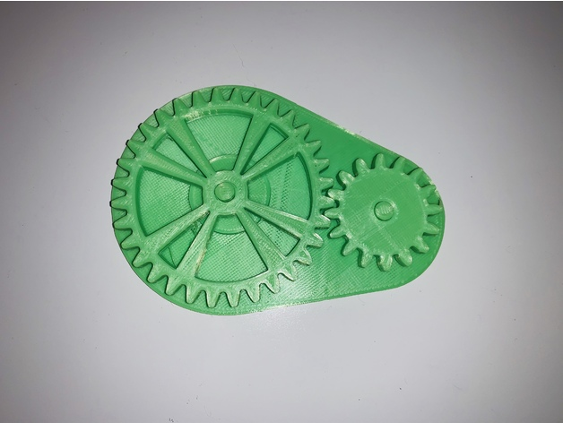
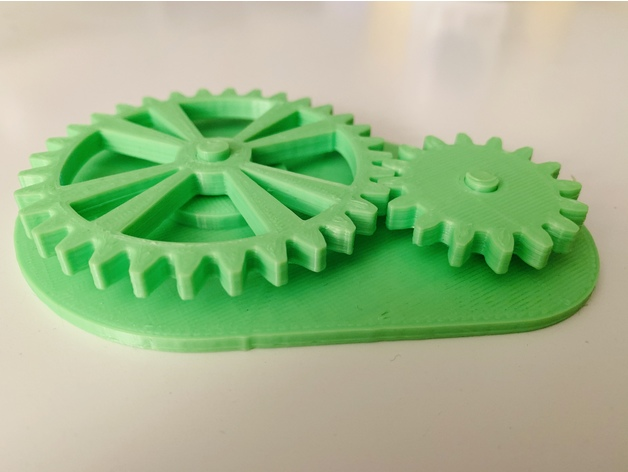

# 2 to 1 Ratio Gears
A simple model/toy that was a learning experience of one how to design and model gears in Fusion360 and secondly the animation features.

Back to [MAIN README](../README.md)

There is two sets of files, one with the whole thing which I have not tested and then the individual files (I printed the individual files in one print i.e. sliced together).

## Files
[STL Files](stl/)


## Print Settings
```
Printer: Ender 3
Rafts: No
Supports: No
Resolution: 0.2mm
Infill: 20%
Filament: PLA
```

## Images

