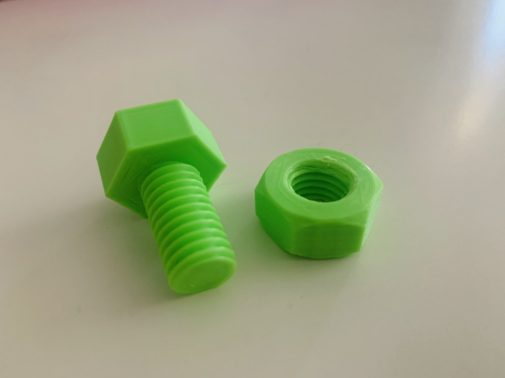
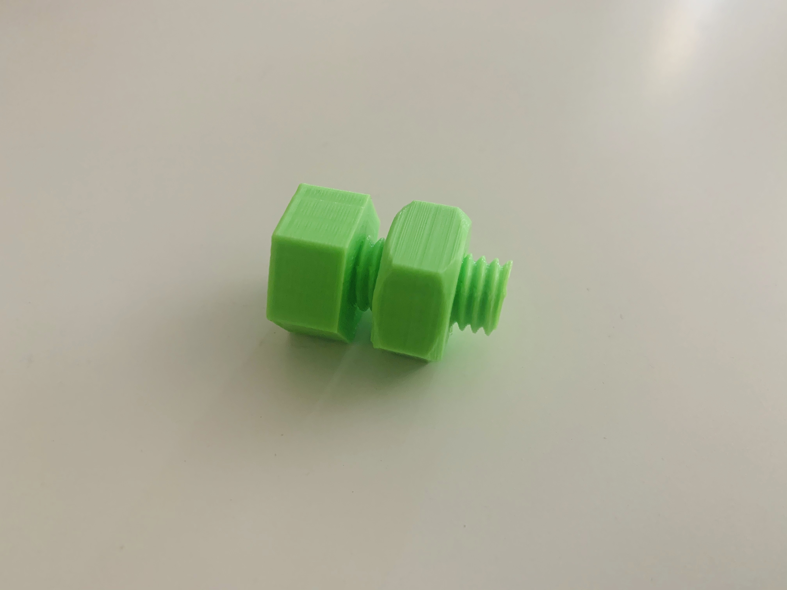

# M12 Nut & Bolt
A simple M12 nut and bolt created when testing/learning threads in Fusion360 and tolerances. The .STL's show them upright, slice and print them flat (with threads parallel to the z-axis).

Length of the bolt is 30mm (including head, 20mm is thread).

Thread info:
* GB Metric Profile
* 12.0mm
* M12x1.75
* 6g
* Right-hand direction

Back to [MAIN README](../README.md)

## Files
[STL Files](stl/)

## Print Settings
```
Printer: Ender 3
Rafts: No
Supports: No
Resolution: 0.15mm (0.2mm is fine)
Infill: 20% (greater if after a more robust print)
Filament: PLA
Wall Thickness: 2mm
Wall Line Count: 5
Horizontal Expansion: -0.5mm (snug fit but not loose, set to -0.3mm for a tighter fit)
Top/Bottom Speed: 15mm/s
```

## Images

