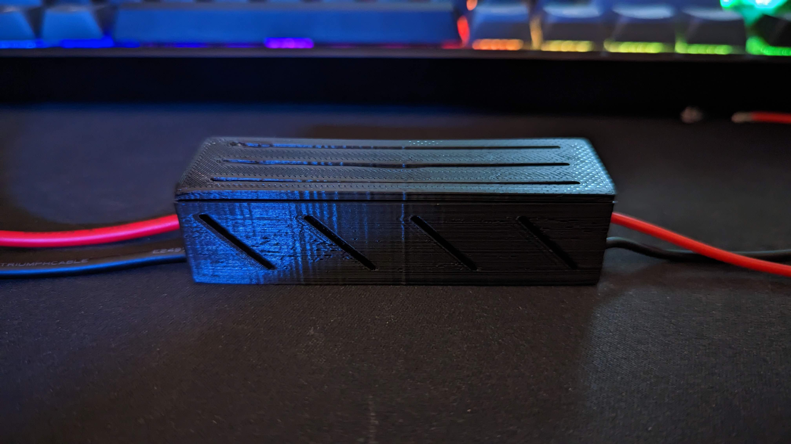
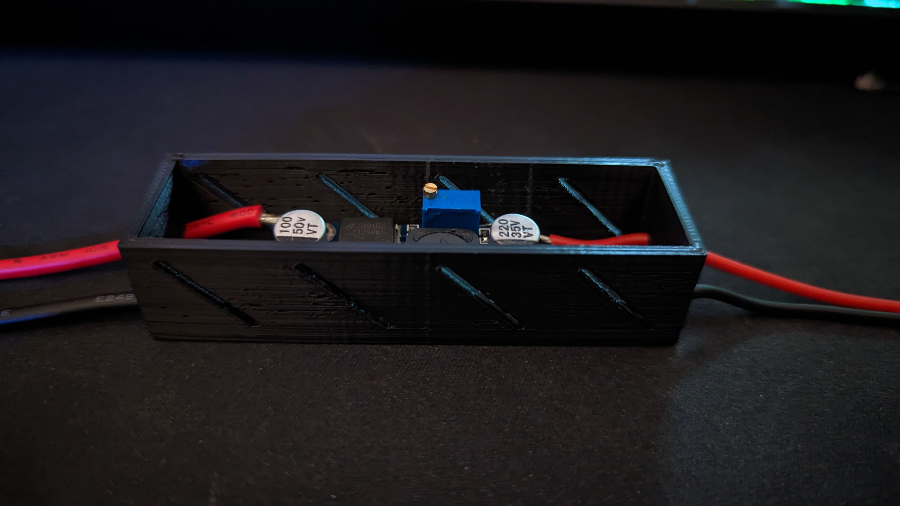
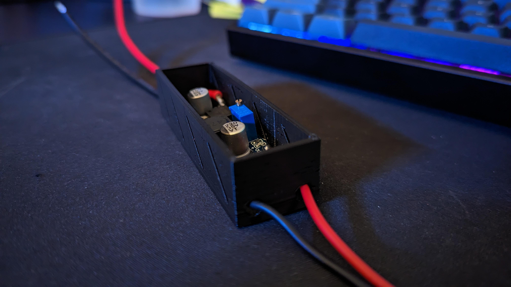
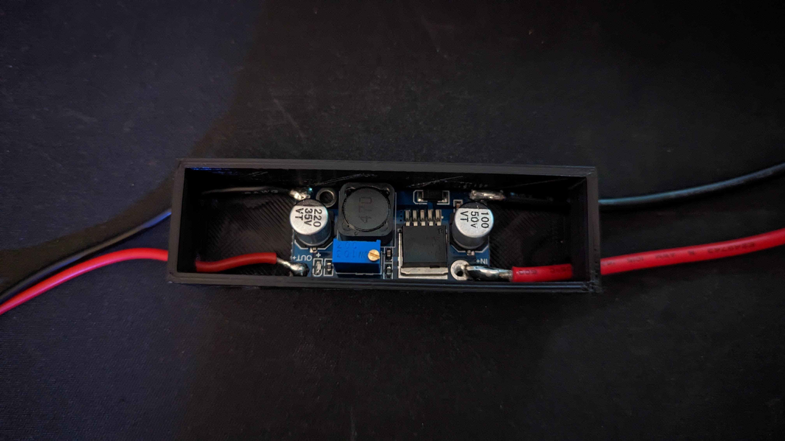
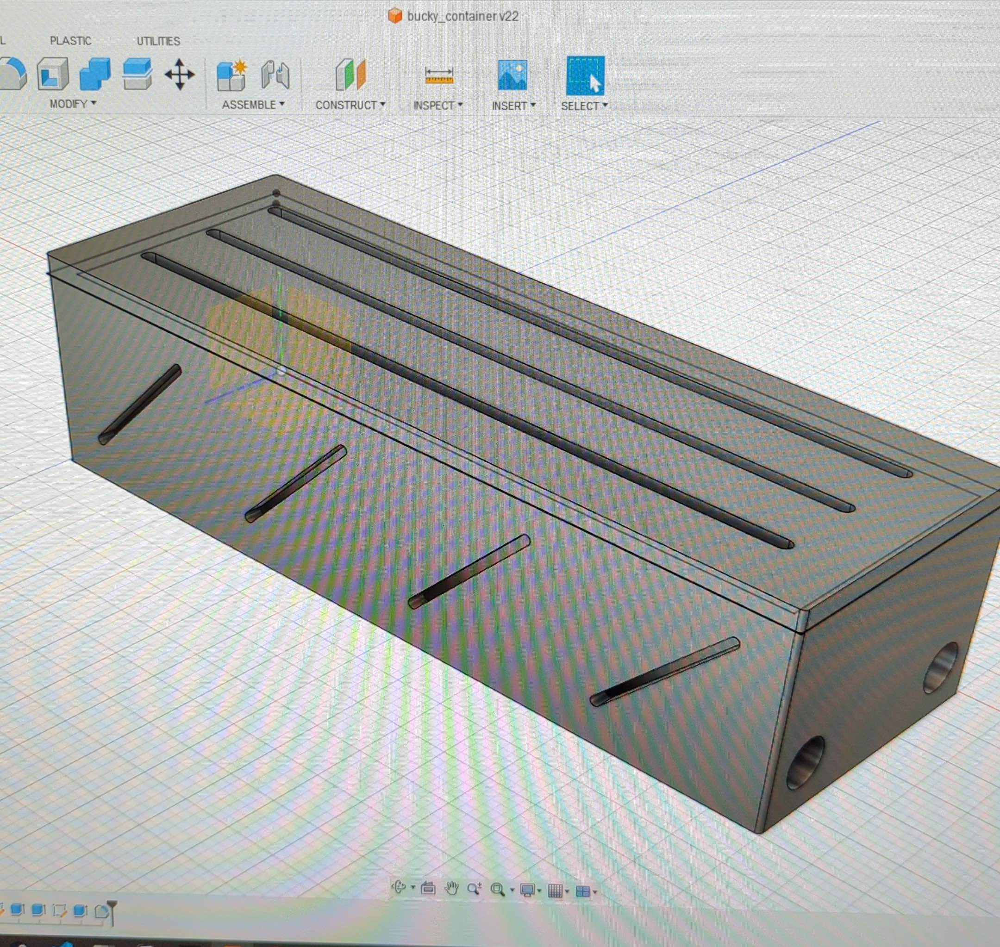

# buck_converter_with_lid
Back to [MAIN README](../README.md)

Container for a buck converter (also known as a step-down module) and lid so no exposed contacts or potential for shocks. Lid is a snug fit so it won't just fall off.

### Dimensions
- Length - `85mm`
- Width - `30mm`
- Thickness of Walls - `2mm`
- Height of Box - `20mm` (then add `2mm` for lid thickness)
- Thick cable hole size - `6mm` (image has `14AWG` cable)
- Thinner cable hole size - `5mm` (image has `18AWG` cable)

## Files
[STL Files](stl/)

## Print Settings
```
Printer: Ender 3
Rafts: No
Supports: No
Resolution: 0.2mm
Infill: 10%
Filament: PLA
```

## Images





