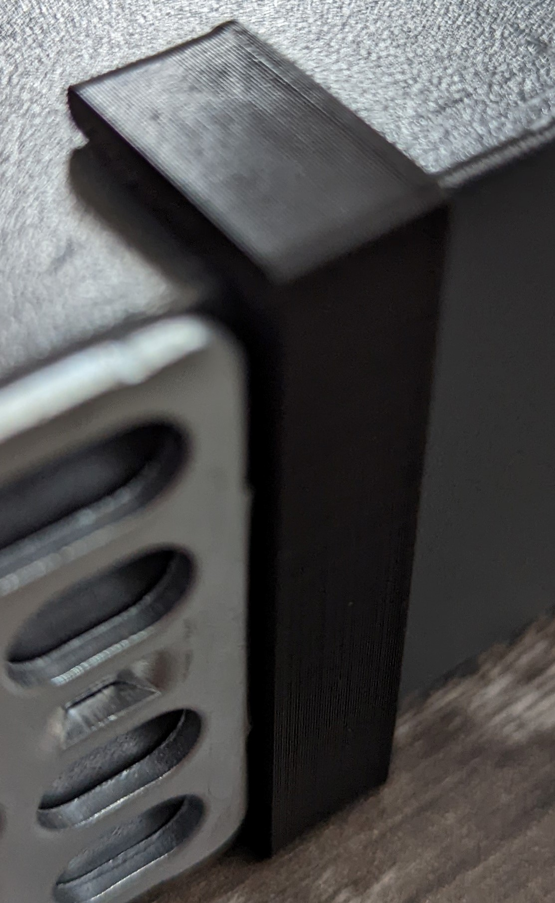

# Cisco Catalyst 3560 Series Switch Spacer
Back to [MAIN README](../README.md)

A Cisco Catalyst 3560 Series Switch spacer.

I don't have a server rack so printed spacers that compression-fit onto the switch to keep it from touching other networking equipment.

Dimensions - 49.3mm (H, inner heigh of switch is 43.3mm) x 18mm (D, how far it holds the switch) x 10mm (W)

## Files
[STL Files](stl/)

## Print Settings
```
Printer: Ender 3
Rafts: No
Supports: No
Resolution: 0.2mm
Infill: 90%
Filament: PLA
```

## Print Notes
- Print with a high infill for rigidity

## Images

