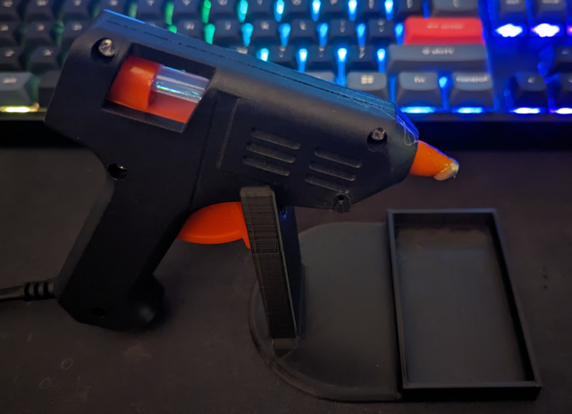
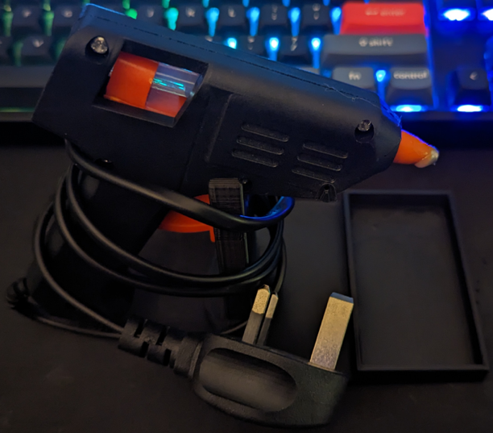

# glue_gun_holder
Back to [MAIN README](../README.md)

## Files
[STL Files](stl/)

## Print Settings
```
Printer: Ender 3
Rafts: No
Supports: No
Resolution: 0.2mm
Infill: 10%
Filament: PLA
```

## Images


