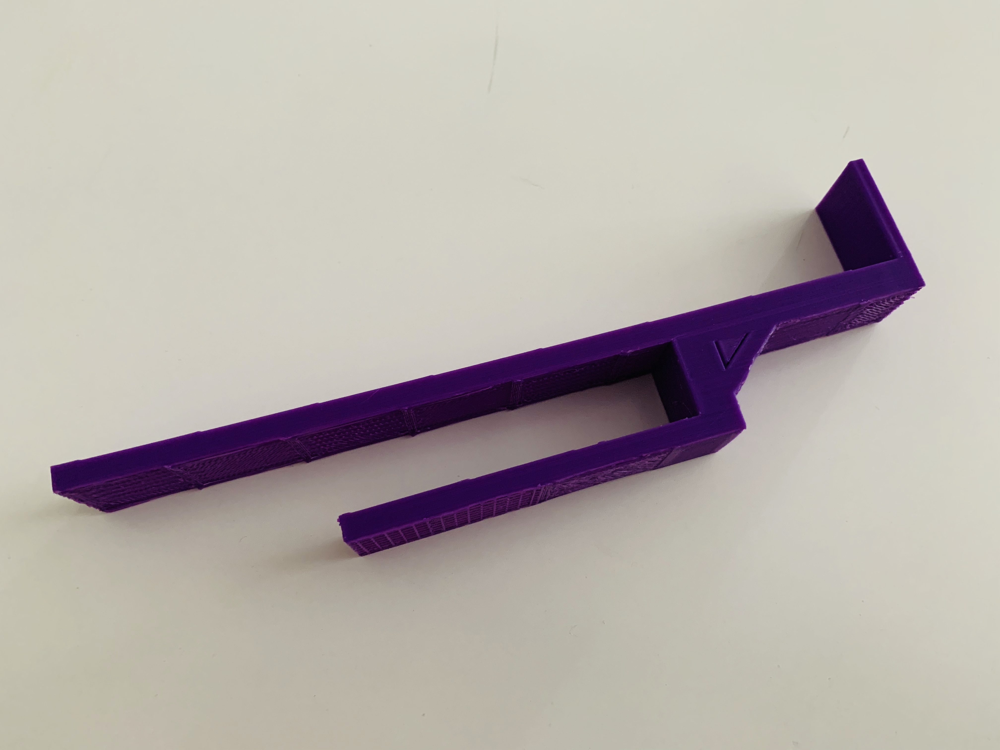

# Desk Headset Holder
A simple headset holder as I wanted to utilise some space off my desk and what better than a holder to hang over the edge!

I made this wayyyyy too thick, so I'd recommend to scale it down. Each "bar" is 5mm thick, on the plus side is it is solid AF but it also took 4.5hours to print.

Make sure you print this flat i.e. rotate and drop it down in your slicing software.

I measured this to fit exactly an IKEA desk with the desk-top thickness of 16.6mm.

Back to [MAIN README](../README.md)

## Files
[STL Files](stl/)

## Print Settings
```
Printer: Ender 3
Rafts: No
Supports: Yes
Resolution: 0.15mm (0.2mm is fine)
Infill: 20%
Filament: PLA
```

## Images


