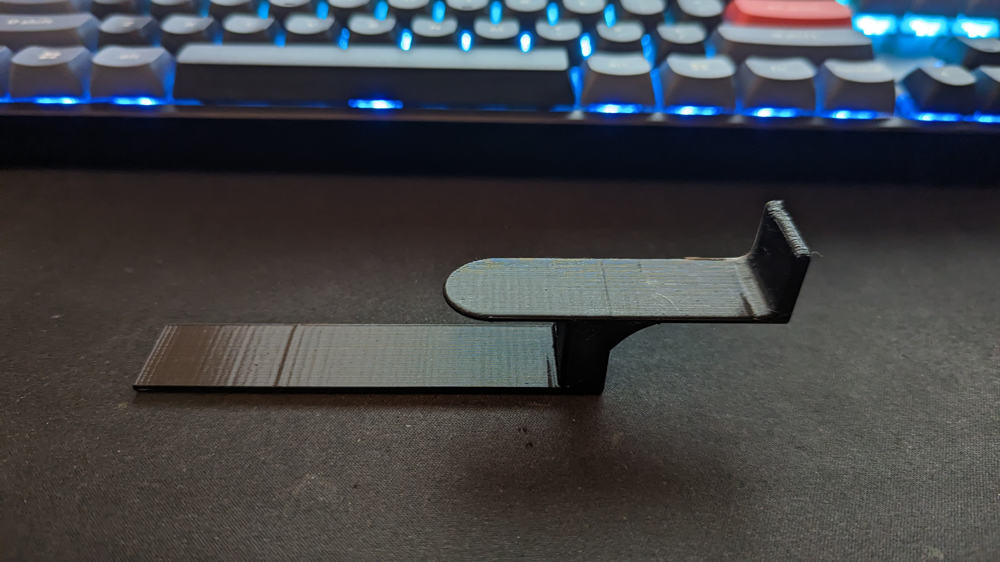

# headset_holder_v2
Back to [MAIN README](../README.md)

## Files
[STL Files](stl/)

## Print Settings
```
Printer: Ender 3
Rafts: Yes (4-5 lines brim to keep it stuck to bed)
Supports: No
Resolution: 0.2mm
Infill: 100%
Filament: PLA
```

## Notes
- Print with a brim with about 4/5 lines to keep it stuck to the bed
- Print on its side

## Images

