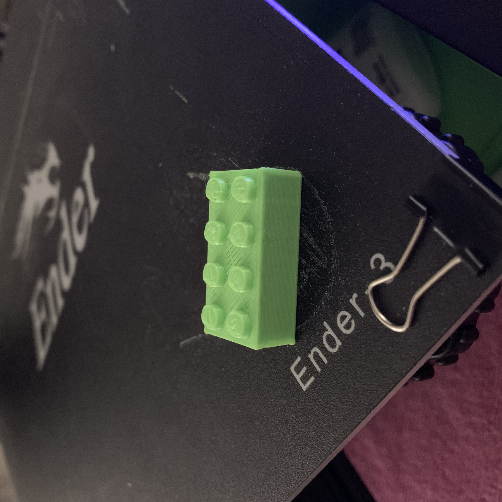

# Lego Brick 4x2
A normal sized lego brick that fits with actual lego.

Back to [MAIN README](../README.md)

## Files
[STL Files](stl/)

## Print Settings
```
Printer: Ender 3
Rafts: No
Supports: No
Resolution: 0.2mm
Infill: 20%
Filament: PLA
```

## Images
