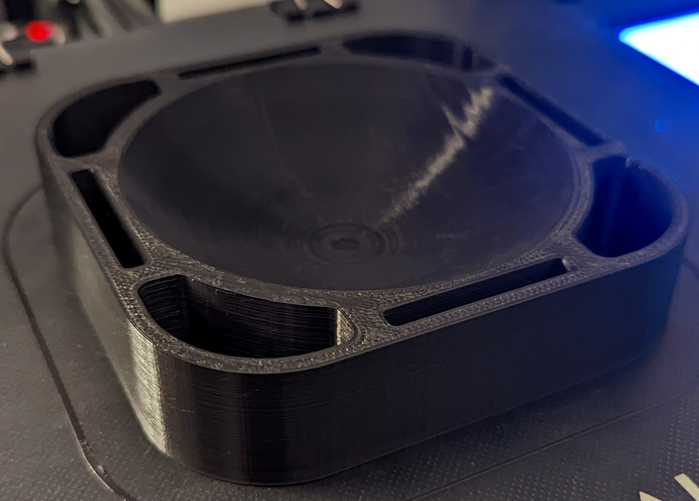
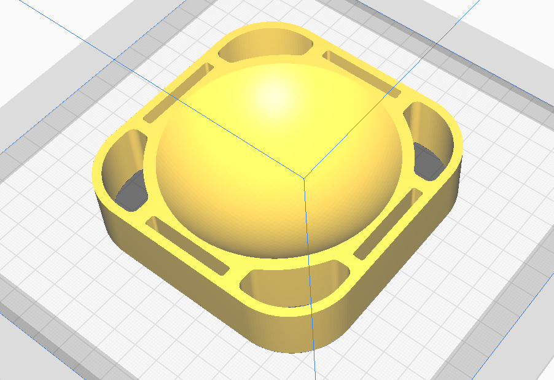

# Mova Globe Stand/Holder - 4.5inch
Back to [MAIN README](../README.md)

A 4.5inch Mova Globe custom stand as I wasn't a fan of the see-through plastic one that it comes with.

Dimensions - 110mm (W) x 110mm (L) x 25mm (H)

## Files
[STL Files](stl/)

## Print Settings
```
Printer: Ender 3
Rafts: No
Supports: No
Resolution: 0.25mm
Infill: 10%
Filament: PLA
```

## Print Notes
- No supports required
- Print a slower and thicker first layers to ensure good adhesion to the bed

## Images


