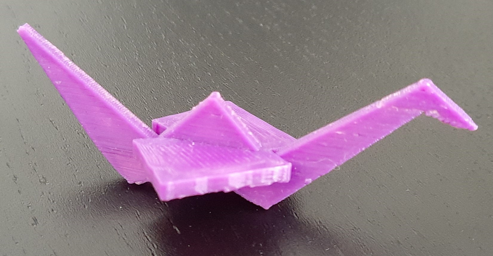

# origami_crane
A simple orgami cubism-influenced crane. Nothing fancy, you will need to print with supports and there will be a lot!

Back to [MAIN README](../README.md)

## Files
[STL Files](stl/)

## Print Settings
```
Printer: Ender 3
Rafts: No
Supports: Yes
Resolution: 0.15mm
Infill: 20%
Filament: PLA
```

## Images

