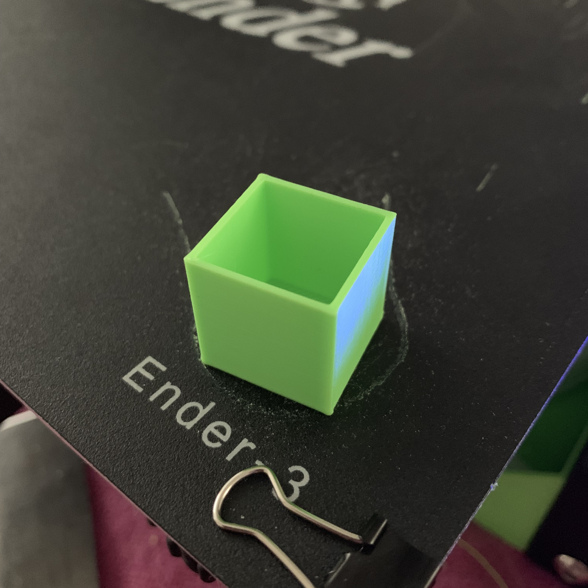

# Topless container
A small cube that is my first 3D model creation that I have printed.

It actually doubles up as a nice container for storage, normal import size is 200mm^2 so can scale it down as required.

Back to [MAIN README](../README.md)

## Files
[STL Files](stl/)

## Print Settings
```
Printer: Ender 3
Rafts: No
Supports: No
Resolution: 0.2mm
Infill: 20%
Filament: PLA
```

## Images
