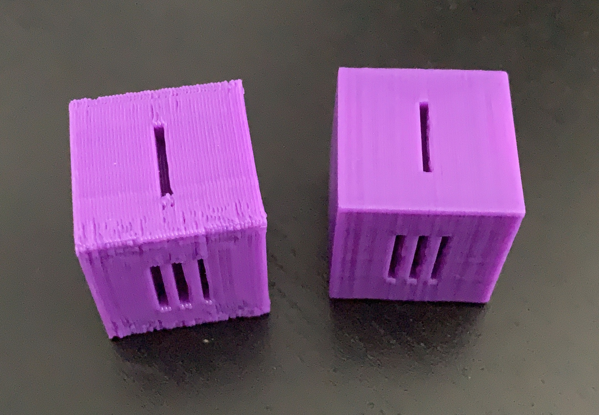

# Tally Dice
Simple dice which has tally marks instead of numbers. Has a small 0.5mm filleted edge for smoothness.

The dimensions of the initial scale are 20mm^3 and is scalable. The image on the left is a quick and dirty 0.4mm res 20% infill print and the right is a 0.15mm 20% infill print.

`Note` - I did not print with supports for the small overlap within some of the grooves of the tally and dependent on how well you have dialed in your printer it might string a little or not be as clean as the rest of the print.

Back to [MAIN README](../README.md)

## Files
[STL Files](stl/)

## Print Settings
```
Printer: Ender 3
Rafts: No
Supports: No
Resolution: 0.15mm
Infill: 20%
Filament: PLA
```

## Images
